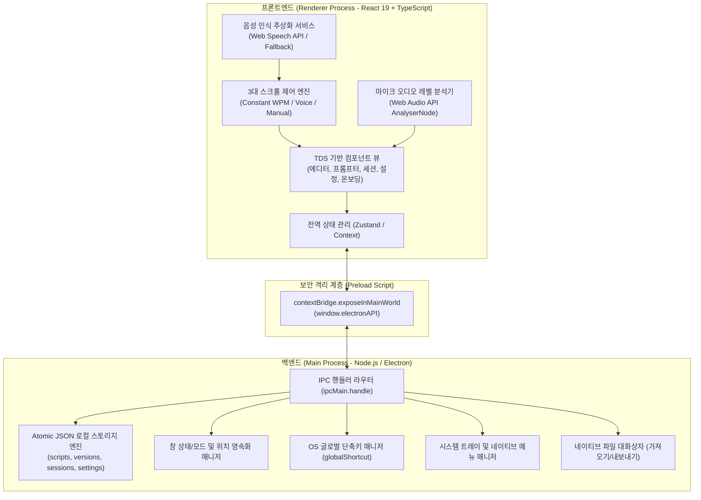

# RehearsePrompt - 시스템 아키텍처 설계서 (Architecture)

> 문서 버전: 1.0.0  
> 최종 수정일: 2026-09-10  
> 상태: 초기 설계 승인 대기

---

## 1. 아키텍처 개요 및 설계 철학

RehearsePrompt는 **오프라인 우선(Offline-First), 로컬 데이터 주권(Local Data Sovereignty), 플랫폼 투명성(Platform Transparency)** 원칙을 바탕으로 설계된 크로스 플랫폼 데스크톱 애플리케이션입니다.



---

## 2. 프로세스 분리 및 보안 아키텍처

### 2.1 보안 제약 정책 (Electron Security Checklist)
- `nodeIntegration: false` 강제 적용: 렌더러 프로세스에서 Node.js 네이티브 모듈 직접 접근 차단.
- `contextIsolation: true` 강제 적용: 렌더러와 preload 스크립트의 JavaScript 실행 컨텍스트 완전 분리.
- `sandbox: true` 적용: 렌더러 프로세스의 OS 시스템 자원 직접 조작 방지.
- `webSecurity: true`: 동일 출처 정책(SOP) 유지 및 로컬 리소스 무단 접근 차단.
- **화면 캡처 방지 API 절대 배제**: `setContentProtection(false)` 상태 유지 및 관련 API 호출 금지.

### 2.2 IPC 채널 및 계약 (Contract Interface)

| 채널명 | 방향 | 설명 |
|---|---|---|
| `app:get-info` | Renderer -> Main | 앱 버전, 실행 환경(OS, 아키텍처) 및 데이터 경로 반환 |
| `script:get-all` | Renderer -> Main | 스크립트 목록 조회 (정렬, 필터 메타데이터) |
| `script:get-by-id` | Renderer -> Main | 단일 스크립트 전체 본문 및 버전 히스토리 반환 |
| `script:save` | Renderer -> Main | 스크립트 신규 저장 및 갱신 (자동 버전 스냅샷 생성) |
| `script:delete` | Renderer -> Main | 스크립트 휴지통 이동 또는 영구 삭제 |
| `script:restore` | Renderer -> Main | 휴지통의 스크립트 복원 |
| `session:save` | Renderer -> Main | 연습 세션 결과 통계 저장 |
| `session:get-history` | Renderer -> Main | 스크립트별/전체 연습 세션 이력 조회 |
| `settings:get` | Renderer -> Main | 사용자 앱 설정 및 프롬프터 환경설정 조회 |
| `settings:save` | Renderer -> Main | 변경된 설정 저장 및 즉시 반영 |
| `window:set-always-on-top`| Renderer -> Main | 창 항상 위 모드 On/Off 토글 |
| `window:set-opacity` | Renderer -> Main | 창 투명도(0.5 ~ 1.0) 설정 |
| `window:minimize / close` | Renderer -> Main | 창 최소화 / 안전 닫기 요청 |
| `dialog:export-file` | Renderer -> Main | TXT / Markdown / JSON 백업 파일 내보내기 |
| `dialog:import-file` | Renderer -> Main | 외부 파일 읽기 및 데이터 정합성 검증 |
| `shortcut:register` | Renderer -> Main | 사용자 정의 글로벌 단축키 등록 및 충돌 검사 |
| `shortcut:triggered` | Main -> Renderer | OS 글로벌 단축키 입력 발생 시 프론트엔드로 이벤트 전달 |

---

## 3. 로컬 스토리지 아키텍처 (Data Sovereignty)

1. **저장 위치**:
   - Windows: `%APPDATA%/RehearsePrompt/data/`
   - macOS: `~/Library/Application Support/RehearsePrompt/data/`
2. **저장 방식**:
   - **Atomic Write 파일 트랜잭션**: 파일 저장 시 임시 파일(`.tmp`)에 완전 기록 후 `fs.renameSync`를 통해 교체하여 앱 비정상 종료 시에도 데이터 손상 방지.
   - 디렉터리 분리:
     - `data/scripts.json`: 스크립트 메타 및 본문 데이터
     - `data/versions/`: 스크립트 ID별 이전 버전 10개 스냅샷
     - `data/sessions.json`: 연습 세션 기록
     - `data/settings.json`: 사용자 설정 및 단축키 매핑
     - `data/window-state.json`: 창 위치, 크기, 모드 상태

---

## 4. 텔레프롬프터 엔진 및 스크롤 아키텍처

### 4.1 일정 속도 자동 스크롤 (Constant Speed)
- 계산 공식:
  $$\text{Speed (px/sec)} = \frac{\text{WPM} \times \text{Avg Sentence Line Height}}{\text{Words Per Line}}$$
- 1초당 60프레임(`requestAnimationFrame`) 단위로 delta 타임을 측정하여 물리적인 화면 주사율(60Hz, 120Hz, 144Hz)에 종속되지 않고 일정한 속도로 부드럽게 스크롤.
- 속도 변경 시(예: 120 WPM -> 150 WPM) 300ms 지수 감쇠 보간(Exponential Smoothing)을 적용하여 화면이 튀지 않도록 제어.

### 4.2 음성 인식 기반 자동 스크롤 (Voice-Guided)
- `SpeechRecognitionService` 인터페이스 정의:
  ```typescript
  export interface ISpeechRecognitionService {
      start(options: { lang: string; onResult: (text: string) => void; onError: (err: unknown) => void }): void;
      stop(): void;
      isSupported(): boolean;
  }
  ```
- **어절 매칭 알고리즘**:
  1. 대본을 문장 및 형태소/어절 배열로 사전 전처리(Tokenize).
  2. 음성 인식된 실시간 스트림 텍스트의 마지막 2~4개 어절을 슬라이딩 윈도우로 추출.
  3. 현재 뷰포트 인근 $\pm 3$문장 영역 내에서 Levenshtein 유사도 및 어절 일치도를 비교하여 가장 신뢰도(Confidence $\ge 0.65$)가 높은 문장을 현재 문장으로 타겟팅.
  4. 타겟 문장이 뷰포트의 상단 $35\% \sim 40\%$ 시선 밴드(Eye-Contact Band)에 위치하도록 부드럽게 자동 스크롤.

---

## 5. UI/UX 디자인 시스템 계층 (TDS 준수)

- 토스 디자인 시스템(TDS) 사양에 맞춘 컴포넌트 킷:
  - `src/renderer/components/common/TButton.tsx` (XL/L/M/S)
  - `src/renderer/components/common/TBottomCTA.tsx` (고정 액션 + 그라디언트 림)
  - `src/renderer/components/common/TTextField.tsx` (48px 포커스 1.5px 블루 보더)
  - `src/renderer/components/common/TListRow.tsx` (리스트 표준 행)
  - `src/renderer/components/common/TDialog.tsx` (20px 라운드 표준 모달)
  - `src/renderer/components/common/TToast.tsx` (grey-900 표면 + 녹색 성공 체크)
  - `src/renderer/components/common/TSegmentedControl.tsx` (분절 선택)
  - `src/renderer/components/common/TSwitch.tsx` (토글 스위치)
  - `src/renderer/components/common/TSlider.tsx` (WPM 및 볼륨 슬라이더)
