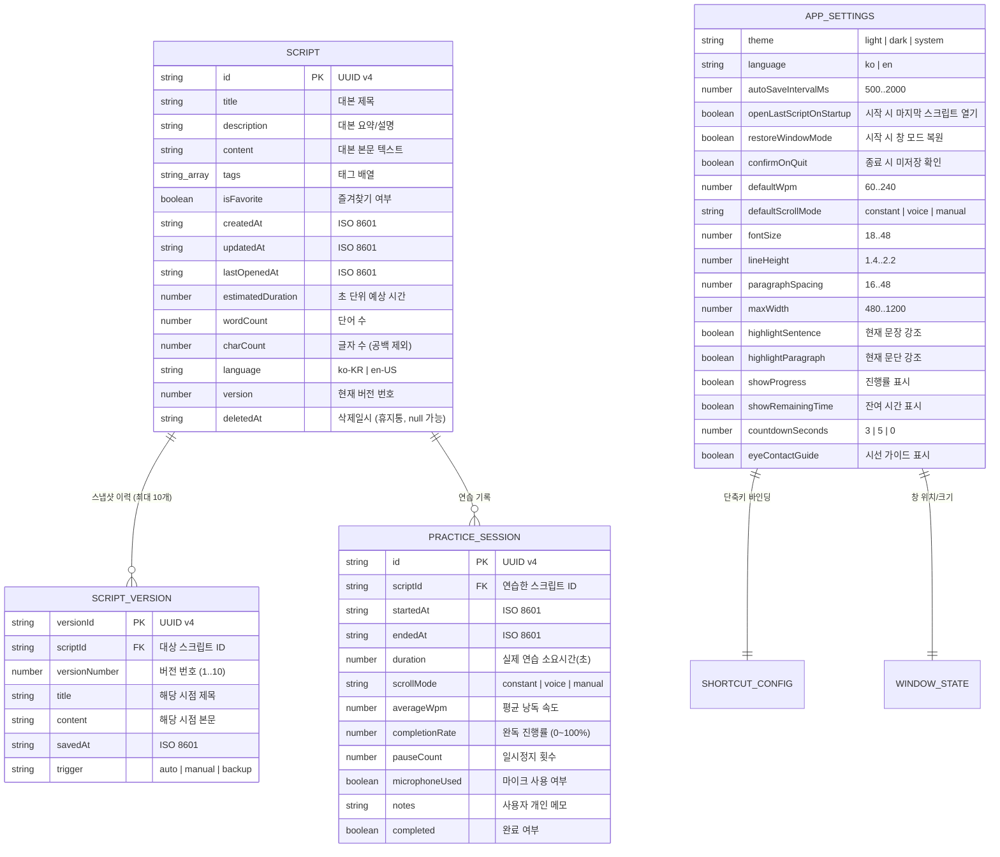

# RehearsePrompt - 데이터 모델 정의서 (Data Model)

> 문서 버전: 1.0.0  
> 최종 수정일: 2026-09-10  
> 상태: 초기 설계 승인 대기

---

## 1. 핵심 데이터 모델 구조도



---

## 2. TypeScript 인터페이스 명세

```typescript
export type ScrollMode = 'constant' | 'voice' | 'manual';
export type AppTheme = 'light' | 'dark' | 'system';
export type AppLanguage = 'ko' | 'en';

export interface IScript {
    id: string;
    title: string;
    description: string;
    content: string;
    tags: string[];
    isFavorite: boolean;
    createdAt: string;
    updatedAt: string;
    lastOpenedAt: string;
    estimatedDuration: number; // seconds
    wordCount: number;
    charCount: number;
    language: 'ko-KR' | 'en-US';
    version: number;
    deletedAt: string | null;
}

export interface IScriptVersion {
    versionId: string;
    scriptId: string;
    versionNumber: number;
    title: string;
    content: string;
    savedAt: string;
    trigger: 'auto' | 'manual' | 'backup';
}

export interface IPracticeSession {
    id: string;
    scriptId: string;
    startedAt: string;
    endedAt: string;
    duration: number; // seconds
    scrollMode: ScrollMode;
    averageWpm: number;
    completionRate: number; // 0 to 100
    pauseCount: number;
    microphoneUsed: boolean;
    notes: string;
    completed: boolean;
}

export interface IShortcutConfig {
    togglePlay: string;      // 기본값: 'CommandOrControl+Shift+Space'
    nextParagraph: string;   // 기본값: 'CommandOrControl+Shift+Down'
    prevParagraph: string;   // 기본값: 'CommandOrControl+Shift+Up'
    speedUp: string;         // 기본값: 'CommandOrControl+Shift+]'
    speedDown: string;       // 기본값: 'CommandOrControl+Shift+['
    resetTop: string;        // 기본값: 'CommandOrControl+Shift+Home'
}

export interface IWindowState {
    x: number | undefined;
    y: number | undefined;
    width: number;
    height: number;
    isMaximized: boolean;
    isAlwaysOnTop: boolean;
    opacity: number;
    lastMode: 'editor' | 'prompter' | 'compact';
}

export interface IAppSettings {
    theme: AppTheme;
    language: AppLanguage;
    autoSaveIntervalMs: number;
    openLastScriptOnStartup: boolean;
    restoreWindowMode: boolean;
    confirmOnQuit: boolean;
    defaultWpm: number;
    defaultScrollMode: ScrollMode;
    fontSize: number;
    lineHeight: number;
    paragraphSpacing: number;
    maxWidth: number;
    highlightSentence: boolean;
    highlightParagraph: boolean;
    showProgress: boolean;
    showRemainingTime: boolean;
    countdownSeconds: number;
    eyeContactGuide: boolean;
    shortcuts: IShortcutConfig;
    windowState: IWindowState;
    speech: {
        enabled: boolean;
        recognitionLanguage: string;
        micGain: number;
        silenceThresholdMs: number;
    };
    privacy: {
        telemetryEnabled: boolean; // 기본 false
        crashReportsEnabled: boolean; // 기본 false
    };
    onboardingCompleted: boolean;
}
```

---

## 3. 데이터 검증 및 무결성 정책 (Validation & Integrity)

1. **ID 및 키 규칙**: 모든 ID는 UUID v4 표준을 사용하며 클라이언트에서 임의의 경로 조작(`../`, `\` 등)을 시도할 수 없도록 영숫자 및 하이픈 정규식으로 검증합니다.
2. **스크립트 버전 스냅샷 보관 정책**:
   - 자동 저장은 동일 버전 번호 내에서 내용을 갱신합니다.
   - 단어 수 10단어 이상의 유의미한 본문 변경 후 5분 경과 시 또는 수동 저장(`Ctrl+S`) 시 새 버전 스냅샷(`IScriptVersion`)을 생성합니다.
   - 스크립트당 최대 10개의 최근 버전을 FIFO(First-In, First-Out) 방식으로 유지하여 디스크 공간을 최적화합니다.
3. **가져오기(Import) 방어 검증**:
   - JSON 파일 가져오기 시 JSON 파싱 에러, 누락된 필수 필드, 비정상적 타입(String 대신 Object 등)을 사전 차단하고 기본값으로 안전하게 폴백합니다.
   - HTML/스크립트 태그 삽입 공격(XSS) 방지를 위해 대본 텍스트는 순수 텍스트(Plain Text)로 치환하여 보관합니다.
