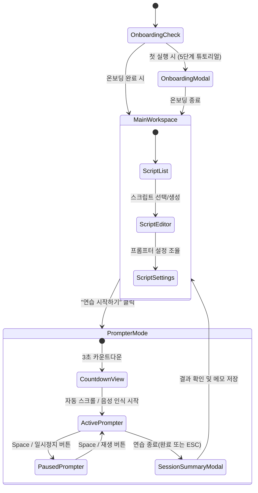

# RehearsePrompt - 사용자 경험 및 인터랙션 설계서 (UX Flow)

> 문서 버전: 1.0.0  
> 최종 수정일: 2026-09-10  
> 상태: 초기 설계 승인 대기

---

## 1. 3클릭 이내 핵심 태스크 완료 보장 규칙

RehearsePrompt는 사용자의 연습 준비 시간을 단축하고 즉각적인 리허설 몰입을 지원하기 위해 **모든 핵심 태스크를 최대 3번의 클릭/입력 이내에 완료**하도록 설계합니다.

| 작업 목적 | 1클릭 | 2클릭 | 3클릭 (완료) |
|---|---|---|---|
| **새 대본 작성** | 좌측 상단 `+ 새 스크립트` 버튼 클릭 | (에디터 제목 필드로 즉시 포커스 이동 및 작성 시작) | — |
| **최근 대본 열기** | 최근 대본 목록 항목 클릭 | (즉시 에디터에 로드 완료) | — |
| **연습 시작** | 에디터 우하단 `연습 시작하기` (BottomCTA) | (3초 카운트다운 후 자동 프롬프터 모드 진입) | — |
| **일시정지 / 재개** | 화면 하단 `일시정지` 버튼 또는 `Space` 키 1회 | — | — |
| **처음으로 되감기**| 하단 컨트롤 바 `처음으로` 버튼 클릭 | — | — |
| **연습 종료** | 상단 `종료` 버튼 또는 `Esc` 키 1회 | 세션 리포트 저장 확인 모달 `완료` 클릭 | — |
| **대본 내보내기** | 에디터 우상단 `내보내기` 메뉴 클릭 | `Markdown (.md)` 또는 `TXT` 선택 | (파일 저장 다이얼로그 즉시 열림) |

---

## 2. 전체 화면 흐름도 (Screen Flow)

---

## 3. 화면별 세부 UI 및 컴포넌트 구조

### 3.1 메인 워크스페이스 (에디터 뷰)
- **헤더 (TopBar)**: 앱 타이틀, 창 모드 토글, 항상 위 고정 핀 아이콘, 시스템 설정 아이콘.
- **좌측 사이드바 (280px)**:
  - 검색창(`SearchField`, 플레이스홀더: "제목, 본문, 태그 검색")
  - 필터 칩(`Chip`: 전체, 즐겨찾기, 최근 수정)
  - 스크립트 카드 목록(`ListRow`: 제목, 첫 문장 미리보기, 수정 시각, 태그 배지)
  - 하단: 휴지통 열기 및 새 스크립트 버튼.
- **중앙 에디터 영역**:
  - 제목 입력 필드 (Display-2급 대형 텍스트 필드)
  - 설명 입력창 (선택 사항)
  - 본문 에디터 (줄 간격 1.6, 문단 구분 명확화, 실시간 문단 번호 인디케이터)
- **우측 정보 패널 (240px)**:
  - 실시간 통계: 글자 수, 단어 수, 130 WPM 기준 예상 읽기 시간(예: "01분 45초")
  - 스크롤 방식 선택기(`SegmentedControl`: 일정 속도 / 음성 인식 / 수동)
  - 목표 WPM 조절 슬라이더
  - 웹캠 아이콘택트 프리뷰 On/Off 스위치
- **하단 고정 바 (BottomCTA)**:
  - "이 스크립트로 연습 시작하기" (TDS 카노니컬 블루 56px 버튼)
  - 저장 상태 인디케이터: "저장되었어요" / "저장 중..." / "저장되지 않은 변경사항이 있어요"

### 3.2 텔레프롬프터 뷰 (집중 연습 화면)
- **상단 투명도 안전 가이드 바**:
  - `안내: 텔레프롬프터는 일반 창으로 표시되며 화면 공유 시 상대방에게 노출될 수 있어요.`
  - 현재 경과 시간, 잔여 예상 시간, 완독 진행률 퍼센트 게이지.
- **중앙 낭독 뷰포트**:
  - 카메라 렌즈 인접 구역(상단 35% 지점)에 은은한 수평 **아이콘택트 포커스 라인** 표시.
  - 현재 읽는 문장: Toss Blue 배경 하이라이트(`oklch(0.965 0.020 250)`) 및 굵은 글씨.
  - 지나간 문장: 차분한 `grey-500`으로 톤 다운하여 시선 분산 방지.
  - 앞으로 읽을 문장: `grey-900`의 선명한 가독성 유지.
- **하단 플로팅 컨트롤 덱 (Floating Control Deck)**:
  - 24px 라운드 다이얼로그 스타일 컨트롤러.
  - [처음으로] - [이전 문단] - [재생 / 일시정지 (Space)] - [다음 문단] - [속도 -] [WPM] [속도 +] - [종료(ESC)].
  - 음성 모드 활성화 시: 마이크 입력 레벨(dB 게이지)이 실시간 점등.

---

## 4. 에러 및 예외 상황의 UX 카피 규칙 (Navigating Error & 해요체)

토스의 "Navigating Error" 원칙과 대화형 존댓말(해요체)을 엄격히 적용합니다.

| 상황 | 나쁜 예시 | RehearsePrompt 표준 카피 (좋은 예시) | 제공 액션 |
|---|---|---|---|
| **저장 실패** | `Error: EACCES permission denied` | "스크립트를 저장하지 못했어요. 저장 폴더의 권한을 확인한 뒤 다시 시도해 주세요." | [다시 시도] [다른 이름으로 저장] |
| **마이크 권한 거부** | `Microphone permission denied` | "마이크 권한이 꺼져 있어서 음성 스크롤을 시작할 수 없어요. 일정 속도 자동 스크롤로 계속 연습할 수 있어요." | [일정 속도로 변경] [권한 설정 열기] |
| **마이크 없음** | `No audio input device` | "연결된 마이크를 찾을 수 없어요. 마이크 연결을 확인하시거나 수동 스크롤을 이용해 주세요." | [마이크 다시 검색] [수동 스크롤] |
| **단축키 충돌** | `Failed to register global shortcut` | "선택한 단축키가 다른 앱에서 이미 사용 중이에요. 다른 키 조합을 추천해 드릴게요." | [추천 단축키 적용] [설정 변경] |
| **잘못된 JSON 파일** | `SyntaxError: Unexpected token` | "가져오려는 파일의 형식이 올바르지 않아요. 올바른 백업 파일(.json)인지 확인해 주세요." | [파일 다시 선택] |
| **종료 전 미저장** | `Unsaved changes exist!` | "저장되지 않은 변경사항이 있어요. 지금 저장하고 종료할까요?" | [저장하고 종료] [저장 안 함] [취소] |
